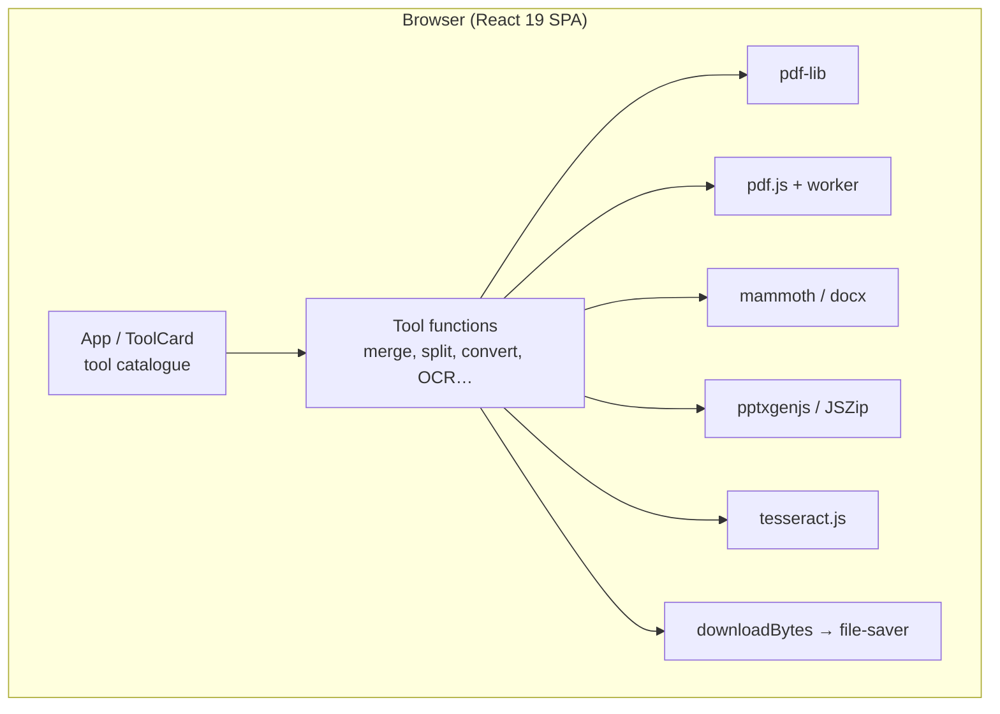

# Local PDF Toolbox (open-source-document-converter)

**20 PDF and Office conversion tools that run entirely in the browser — no uploads, no server.**

       

**Local PDF Toolbox** (repository `open-source-document-converter`, package `pdf-toolbox-web`) is a single-page React app
that offers 20 document tools — Merge, Split, Compress, Repair, Remove/Extract/Organize pages, Edit (add text), PDF↔Word,
PDF↔PowerPoint, PDF↔Excel, PDF↔JPG, Scan to PDF, HTML to PDF, OCR and "PDF/A-style" export. **Every file is processed
inside the user's browser** with JavaScript libraries (pdf-lib, pdf.js, mammoth, docx, pptxgenjs, JSZip, tesseract.js),
so documents never leave the device. It is a static Vite build hosted on Vercel at **convert.hirav.me**.

Because browsers do not contain Microsoft Office or LibreOffice, Office conversions preserve text/data or render pages
as images rather than reproducing exact layouts — this trade-off is intentional and stated in the app.

**Live:** https://convert.hirav.me

## Table of contents

1. [At a glance](#at-a-glance)
2. [Key features](#key-features)
3. [Tech stack](#tech-stack)
4. [Architecture in one picture](#architecture-in-one-picture)
5. [Repository structure](#repository-structure)
6. [Getting started](#getting-started)
7. [Configuration](#configuration)
8. [Available scripts](#available-scripts)
9. [Testing](#testing)
10. [Deployment](#deployment)
11. [Documentation](#documentation)
12. [Project status](#project-status)
13. [Contributing](#contributing)
14. [Security](#security)
15. [Licence](#licence)
16. [Contacts](#contacts)

## At a glance

|  |  |
|---|---|
| What it is | A private, free alternative to online PDF sites - merge, split, compress, convert and OCR files locally in your browser. |
| Who it is for | Anyone who needs quick PDF/Office conversions without uploading documents to a third-party server. |
| Status | Active — live at convert.hirav.me |
| Primary language | JavaScript (React 19 + Vite 7) |
| Hosting | Vercel (static Vite build) → https://convert.hirav.me |
| Repository | Public — `HiravK/open-source-document-converter` |
| Default branch | `main` |
| Commits / first / latest | 2 commits · 2026-05-29 → 2026-05-29 |
| Contributors | Hirav K (2) |

## Key features

- **Organize PDF** — Merge (ordered), Split (one PDF per page), Remove pages, Extract pages, Organize (reorder by page sequence)
- **Optimise** — Compress (re-save with object streams) and Repair (load and re-save)
- **Convert from PDF** — PDF → Word (text into DOCX), PDF → Excel (text lines into sheets), PDF → PowerPoint (each page rendered as a slide image), PDF → JPG (each page as an image, zipped)
- **Convert to PDF** — Word (DOCX text via mammoth), PowerPoint (slide text + best slide image), Excel (cell values), JPG/PNG/WebP images, Scan to PDF, HTML text
- **Edit PDF** — Add text to the first page
- **OCR PDF** — Renders pages and runs tesseract.js locally; exports searchable text as a PDF
- **PDF/A-style** — Cleaned archival-style export (metadata set; not certified PDF/A)
- **Privacy by design** — No backend, no upload endpoint; the only network use is loading the app and OCR language data

## Tech stack

| Layer | Technology | Why it is used |
|---|---|---|
| UI | React 19, lucide-react | Interface and icons |
| Build | Vite 7 + @vitejs/plugin-react | Dev server and bundling |
| PDF | pdf-lib, pdfjs-dist 5 | Write and read PDFs |
| Office | mammoth, docx, pptxgenjs, JSZip | Word/PowerPoint/Excel handling |
| OCR | tesseract.js 6 | Local text recognition |
| Download | file-saver | Save results |
| Hosting | Vercel | Static hosting |

## Architecture in one picture



Full detail: [docs/ARCHITECTURE.md](docs/ARCHITECTURE.md).

## Repository structure

```text
open-source-document-converter/
├── index.html
├── src/
│   ├── main.jsx      # UI + all 20 tools + helpers
│   └── styles.css
├── vite.config.js
├── vercel.json       # SPA rewrite, dist output
└── package.json      # name: pdf-toolbox-web
```

## Getting started

### Prerequisites

- Node.js 20+
- npm

### Install and run locally

```bash
git clone https://github.com/HiravK/open-source-document-converter.git
cd open-source-document-converter
npm install
npm run dev        # http://localhost:5173
npm run build      # production bundle in dist/
```

## Configuration

No environment variables or secrets are required.

## Available scripts

| Command | What it does |
|---|---|
| `npm run dev` | Vite dev server (0.0.0.0) |
| `npm run build` | Production build to dist/ |
| `npm run preview` | Serve the built bundle |

## Testing

No automated tests. Each tool was checked manually with sample files. See [docs/PROJECT.md](docs/PROJECT.md#quality-and-testing).

## Deployment

Vercel builds with `npm run build` and serves `dist/` at convert.hirav.me; every path rewrites to index.html. Step-by-step: [docs/RUNBOOK.md](docs/RUNBOOK.md).

## Documentation

Every document below is part of the project's controlled documentation set.

| Document | Audience | What it answers |
|---|---|---|
| [README](README.md) | Everyone | What is it, how do I run it, where is everything? |
| [Project Overview (in depth)](docs/PROJECT.md) | Everyone | Why it exists, every feature explained, timeline, quality, security, risks, glossary |
| [Product Requirements (PRD)](docs/PRD.md) | Product, business, engineering | What problem, for whom, what must it do, how is success measured? |
| [Architecture](docs/ARCHITECTURE.md) | Engineers, architects | How is it built, how does data flow, where does it run, why? |
| [Runbook](docs/RUNBOOK.md) | Engineers, operators | How do I set it up, configure, deploy, roll back and troubleshoot it? |
| [Session Handover](docs/SESSION_HANDOVER.md) | Next owner / next session | Where exactly did work stop and what is next? |

## Project status

Version 1 with 20 tools was built and deployed on 2026-05-29 at convert.hirav.me. No work is in progress. The code is
in one large file and has no tests; a licence file is missing despite the "open-source" name.

Latest hand-off notes: [docs/SESSION_HANDOVER.md](docs/SESSION_HANDOVER.md).

## Contributing

Branch from the default branch (`feat/…`, `fix/…`), use Conventional Commit messages, open a pull request, and update the docs in the same PR.

## Security

Please do not open public issues for vulnerabilities; contact the maintainer privately. Security design is covered in [docs/PROJECT.md](docs/PROJECT.md#security-and-privacy).

## Licence

No licence file is present, so all rights are reserved by the owner by default. Add a `LICENSE` file before accepting outside contributions or reuse.

## Contacts

| Role | Name | Contact |
|---|---|---|
| Owner / maintainer | Hirav Kadikar | [@HiravK](https://github.com/HiravK) |
