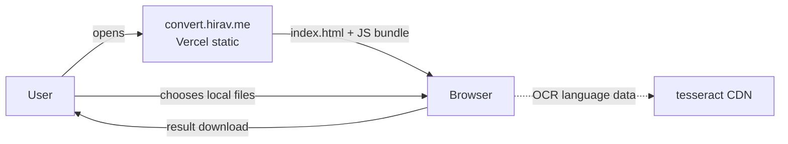
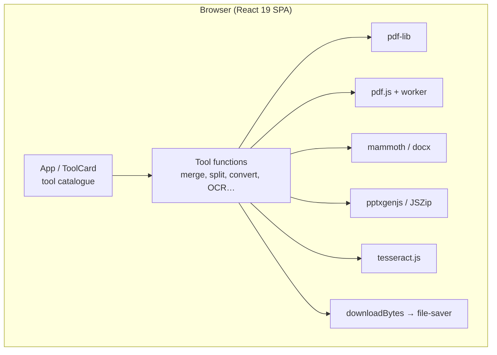
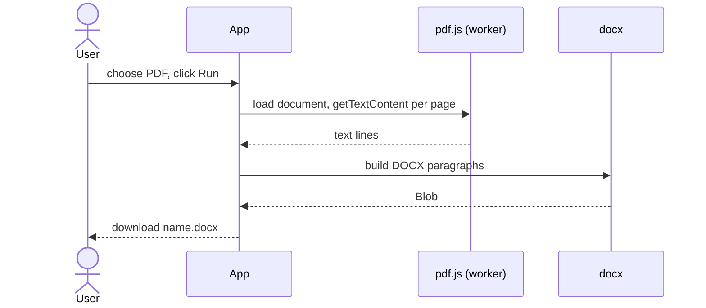

# Architecture Document — Local PDF Toolbox (open-source-document-converter)

| Field | Value |
|---|---|
| Document ID | PDFTB-ARCH |
| Project | Local PDF Toolbox (open-source-document-converter) |
| Repository | [`HiravK/open-source-document-converter`](https://github.com/HiravK/open-source-document-converter) |
| Version | 1.0 |
| Status | Approved — living document |
| Owner | Hirav Kadikar |
| Classification | Public |
| Last updated | 2026-09-25 |

> **Purpose:** Explains how the system is built: its parts, how data moves, where it runs, and why it was built this way. Structured on the C4 model and arc42.

## 1. Revision history

| Version | Date | Author | Change |
|---|---|---|---|
| 1.0 | 2026-09-25 | Hirav Kadikar | Full documentation suite generated from a complete review of the repository. |

## 2. Introduction and goals

A client-only React 19 single-page app built by Vite. `src/main.jsx` holds the tool catalogue (`CATEGORIES`, `TOOLS`),
the UI (`App`, `ToolCard`, `ToolIcon`) and one async function per tool (`mergePdf`, `splitPdf`, `pdfToWord` …). Tools read
the chosen files as ArrayBuffers, transform them with pdf-lib / pdf.js / mammoth / docx / pptxgenjs / JSZip / tesseract.js,
and hand the result to `downloadBytes` (file-saver). pdf.js runs its parser in a Web Worker bundled by Vite
(`pdf.worker.mjs?url`). There is no backend; `vercel.json` serves `dist/` and rewrites every path to `index.html`.

### Quality goals (in priority order)

| Priority | Quality attribute | What it means here |
|---|---|---|
| 1 | Privacy | Files never leave the device |
| 2 | Simplicity | One static bundle, no server |
| 3 | Breadth | Common tools in one place |

## 3. Constraints

- No server-side rendering engines; everything must run in JavaScript/WebAssembly.

## 4. System context (C4 level 1)

Who and what the system talks to.

| External actor / system | Interaction |
|---|---|
| Vercel | Static hosting and SPA rewrite |
| pdf-lib | Create/modify PDFs |
| pdfjs-dist | Read and render PDF pages (worker) |
| mammoth / docx | Read/write Word files |
| pptxgenjs / JSZip | Write PowerPoint; read Office zip packages |
| tesseract.js | Local OCR (downloads language data from a CDN) |

## 5. Containers (C4 level 2)

## 6. Components (C4 level 3)

| Component | Location | Responsibility |
|---|---|---|
| Entry + UI | `src/main.jsx (App, ToolCard, ToolIcon)` | Tool picker, file input, options, run button, status |
| Tool catalogue | `src/main.jsx (CATEGORIES, TOOLS)` | Titles, descriptions, accepted types, handlers |
| PDF tools | `src/main.jsx (mergePdf … pdfToPdfa)` | One async function per tool |
| Helpers | `src/main.jsx (renderPdfPages, createXlsx, readXlsxText, textPdf, parsePageSpec …)` | Rendering, Office XML parsing, text PDF creation, page ranges |
| Styles | `src/styles.css` | Layout and theme |
| Build/deploy | `vite.config.js, vercel.json, package.json` | Vite + React plugin; SPA rewrite |

## 7. Runtime view — key flows

### Convert PDF to Word

## 8. Data architecture

No persistent data. Files exist only in browser memory during processing and are released after download.

## 9. Deployment view

Vercel builds with `npm run build` and serves `dist/` at convert.hirav.me; every path rewrites to index.html.

| Environment | Where | Notes |
|---|---|---|
| Local | http://localhost:5173 (`npm run dev`, bound to 0.0.0.0) | Vite dev server |
| Production | Vercel → https://convert.hirav.me | Static `dist/` |

## 10. Technology stack

| Layer | Technology | Why |
|---|---|---|
| UI | React 19, lucide-react | Interface and icons |
| Build | Vite 7 + @vitejs/plugin-react | Dev server and bundling |
| PDF | pdf-lib, pdfjs-dist 5 | Write and read PDFs |
| Office | mammoth, docx, pptxgenjs, JSZip | Word/PowerPoint/Excel handling |
| OCR | tesseract.js 6 | Local text recognition |
| Download | file-saver | Save results |
| Hosting | Vercel | Static hosting |

## 11. Cross-cutting concepts

### Privacy

The code has no fetch/upload calls for user files; processing is in-memory. OCR downloads language models from a public CDN (no user data sent).

### Fidelity trade-offs

Office ↔ PDF conversions keep text and data, and render images where layout matters; users are told exact layout is not possible in-browser.

### Encrypted PDFs

Tools load PDFs with `ignoreEncryption: true`, so they open but encrypted content may not be processed correctly.

## 12. Architecture decisions (ADR log)

### ADR-01: Process files entirely in the browser

|  |  |
|---|---|
| Status | Accepted |
| Date | 2026-05-29 |
| Context | Users should not have to trust a server with private documents; hosting should cost nothing. |
| Decision | Implement every tool with client-side libraries and ship a static site. |
| Consequences | Strong privacy; Limited Office fidelity and compression; Performance depends on the user's device |
| Alternatives considered | — |

### ADR-02: Single-file implementation for v1

|  |  |
|---|---|
| Status | Accepted |
| Date | 2026-05-29 |
| Context | Speed of delivery. |
| Decision | Keep tools and UI in src/main.jsx. |
| Consequences | Fast to build; Harder to maintain and test — split later |
| Alternatives considered | — |

## 13. Quality scenarios

| Scenario | Expected response |
|---|---|
| User merges 5 PDFs | Download in seconds, no network requests for files |
| User opens the site offline after first load | Non-OCR tools work if assets are cached; OCR needs language data |

## 14. Risks and technical debt

Full register in [PROJECT.md](PROJECT.md#risks-and-technical-debt). Top items:

- **No licence on a repo named open-source** — Add LICENSE
- **Users expect exact Office layouts** — Clear in-app notes
- **Large single file** — Refactor

## 15. Glossary

See [PROJECT.md](PROJECT.md#glossary).
